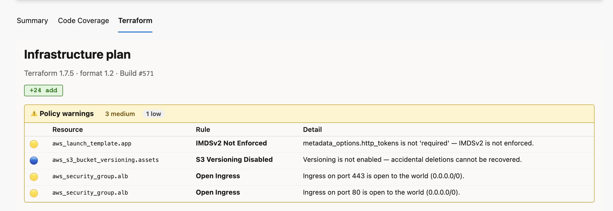

# ADO Terraform Agent

**Terraform pipeline task + interactive plan visualizer for Azure DevOps.**

Run `init`, `plan`, `apply` and more — then open the **Terraform** tab on any build to explore your infrastructure changes with a color-coded diff table, expandable attribute diffs, a real dependency graph, and built-in policy warnings.

---

## ✨ What you get

| | |
|---|---|
| 🔧 **Pipeline task** | `install`, `init`, `validate`, `plan`, `apply`, `show` — all Terraform commands in one task |
| ☁️ **Multi-cloud backends** | Azure (azurerm), AWS (s3), GCP (gcs), custom HCL file, or local |
| 📊 **Plan summary bar** | At-a-glance `+12 add  ~3 change  −1 destroy` before you read a single line |
| 🎨 **Color-coded change table** | Green create · Yellow update/replace · Red destroy — spot risk instantly |
| 🔍 **Expandable attribute diff** | Click any resource row to see a before/after diff of every attribute |
| 🗺️ **Real dependency graph** | Edges parsed from `configuration.references` — actual resource relationships, not just provider grouping |
| ⚠️ **Policy warnings** | Built-in checks for open security groups, unencrypted storage, public S3 buckets, IMDSv2, and more |
| 🔎 **Filter & search** | Filter the change table by address, type, or action kind |
| 💬 **PR comments** | Automatically post a plan summary as a pull request thread comment |
| 🔒 **Minimal permissions** | Only `vso.build`, `vso.build_execute`, and optionally `vso.code_write` for PR comments |
| 🖥️ **Cross-platform** | Linux, macOS, Windows hosted and self-hosted agents (Node 20) |

---

## 🚀 5-minute quick start

### Step 1 — Install the extension

**Organization Settings** (⚙ bottom-left) → **Extensions** → **Browse Marketplace** → search **ADO Terraform Agent** → **Install**.

### Step 2 — Add this to your pipeline YAML

```yaml
pool:
  vmImage: ubuntu-latest

steps:
  - task: subzone.ado-tf-agent.terraform-task.Terraform@0
    displayName: Install Terraform
    inputs:
      command: install
      terraformVersion: 1.9.0

  - task: subzone.ado-tf-agent.terraform-task.Terraform@0
    displayName: Terraform init
    inputs:
      command: init
      workingDirectory: infra

  - task: subzone.ado-tf-agent.terraform-task.Terraform@0
    displayName: Terraform plan
    inputs:
      command: plan
      workingDirectory: infra
      publishPlanArtifact: true   # ← this powers the Terraform tab

  - task: subzone.ado-tf-agent.terraform-task.Terraform@0
    displayName: Terraform apply
    inputs:
      command: apply
      workingDirectory: infra
```

### Step 3 — Open the Terraform tab

Run the pipeline → open the completed build → click the **Terraform** tab.

That's it. You'll see the plan summary, change table, policy warnings, and dependency graph.

---

## 📸 Screenshots

### Resource list and summary bar



### Color-coded change table with expandable diffs


### Real dependency graph


---

## 📋 Plan visualization

### Summary bar

Shows the blast radius at a glance:

```
+20 add   ~3 change   ±1 replace   −2 destroy
```

### Color-coded change table

| Badge | Meaning |
|---|---|
| 🟢 `+ create` | New resource will be created |
| 🟡 `~ update` | Resource will be updated in-place |
| 🟡 `± replace` | Resource will be destroyed and recreated |
| 🔴 `− delete` | Resource will be destroyed |
| ⚪ `○ read` | Data source read |

`no-op` resources (unchanged) are hidden automatically.

Use the **search box** to filter by address or type. Use the **action checkboxes** to show/hide specific change kinds.

### Expandable attribute diff

Click any row to expand a full before/after diff of every attribute:

- Changed attributes highlighted in yellow
- Before values in red, after values in green
- `(known after apply)` for computed values
- `(sensitive)` for masked values — never exposed

### Policy warnings

Built-in checks run automatically against the plan JSON. No external tools or API keys needed.

| Check | Severity |
|---|---|
| S3 bucket public access enabled | 🔴 High |
| Security group open to 0.0.0.0/0 on SSH/RDP | 🔴 High |
| RDS instance unencrypted or publicly accessible | 🔴 High |
| IAM policy with wildcard Action | 🔴 High |
| Azure storage account with HTTP allowed | 🔴 High |
| Security group open to 0.0.0.0/0 on other ports | 🟡 Medium |
| EC2 launch template without IMDSv2 | 🟡 Medium |
| EBS volume unencrypted | 🟡 Medium |
| IAM policy with wildcard Resource | 🟡 Medium |
| S3 versioning disabled | 🔵 Low |

### Dependency graph

Built from actual `configuration.references` in the plan JSON — real edges between resources, color-coded by action kind.

---

## ⚙️ Task reference

### Commands

| Command | Description |
|---|---|
| `install` | Download and cache Terraform on the agent, prepend to PATH |
| `init` | `terraform init` with optional backend config |
| `validate` | `terraform validate` |
| `plan` | `terraform plan -out tfplan` — optionally publishes plan attachment |
| `apply` | `terraform apply tfplan` |
| `show` | `terraform show -json` |

### All inputs

| Input | Command | Default | Description |
|---|---|---|---|
| `terraformVersion` | `install` | `1.7.5` | Version to download, e.g. `1.9.0` |
| `workingDirectory` | all except `install` | agent default | Directory containing `.tf` files |
| `backendType` | `init` | `local` | `local` · `azurerm` · `s3` · `gcs` · `custom` |
| `backendConfigFile` | `init` (custom) | — | Path to HCL or key=value backend config file |
| `planFile` | `plan` · `apply` · `show` | `tfplan` | Plan file name |
| `publishPlanArtifact` | `plan` | `true` | Attach `plan.json` for the Terraform tab |
| `postPrComment` | `plan` | `false` | Post plan summary as a PR thread comment |
| `additionalArguments` | all | — | Extra flags appended to the command |

### Backend configuration

**Azure (`azurerm`)**
```yaml
- task: subzone.ado-tf-agent.terraform-task.Terraform@0
  inputs:
    command: init
    workingDirectory: infra
    backendType: azurerm
    azureResourceGroup: rg-tfstate
    azureStorageAccount: mytfstateacct
    azureContainer: tfstate
    azureStateKey: myapp.tfstate
```

**AWS (`s3`)**
```yaml
- task: subzone.ado-tf-agent.terraform-task.Terraform@0
  inputs:
    command: init
    workingDirectory: infra
    backendType: s3
    awsBucket: my-tf-state-bucket
    awsKey: prod/terraform.tfstate
    awsRegion: us-east-1
    awsDynamoDbTable: tf-lock-table   # optional
```

**GCP (`gcs`)**
```yaml
- task: subzone.ado-tf-agent.terraform-task.Terraform@0
  inputs:
    command: init
    workingDirectory: infra
    backendType: gcs
    gcpBucket: my-tf-state-bucket
    gcpPrefix: terraform/state   # optional
```

**Custom HCL file**
```yaml
- task: subzone.ado-tf-agent.terraform-task.Terraform@0
  inputs:
    command: init
    workingDirectory: infra
    backendType: custom
    backendConfigFile: backend.hcl
```

---

## 💬 PR comment integration

Post a formatted plan summary as a pull request thread comment automatically.

### Setup

1. Enable **Allow scripts to access the OAuth token** in your pipeline settings (Edit pipeline → ··· → Triggers → uncheck "Limit job authorization scope").
2. Add `postPrComment: true` to your plan step:

```yaml
- task: subzone.ado-tf-agent.terraform-task.Terraform@0
  displayName: Terraform plan
  inputs:
    command: plan
    workingDirectory: infra
    publishPlanArtifact: true
    postPrComment: true
```

The comment is only posted on PR builds. On branch builds it is silently skipped.

### What the comment looks like

```
🏗️ Terraform Plan — Build #42

🟢 20 to add · 🟡 3 to change · 🔴 1 to destroy

| | Resource | Action |
|---|---|---|
| 🟢 | aws_vpc.main | create |
| 🟢 | aws_subnet.public_a | create |
...
```

---

## 🔑 Important: full task name

The four-part task name is required in YAML:

```
subzone.ado-tf-agent.terraform-task.Terraform@0
```

Using a shorter form like `subzone.ado-tf-agent.terraform-task@0` produces **"A task is missing"** even when the extension is installed.

---

## 🛠️ Troubleshooting

**"A task is missing" in YAML**
Use the full four-part task name above. Verify the extension is installed on the same organization as the pipeline (Organization Settings → Extensions).

**Terraform tab does not appear**
Ensure `publishPlanArtifact: true` on the plan step and that the step completed successfully. The tab scans the 10 most recent builds for a plan attachment — open a build that ran after installing this version of the extension.

**PR comment not posted**
Enable **Allow scripts to access the OAuth token** in pipeline settings. Confirm the build is triggered by a pull request (the `System.PullRequest.PullRequestId` variable must be set).

**Dependency graph has no edges**
The graph requires `configuration` data in the plan JSON. This is present in normal `terraform plan` output. Plans generated with very old Terraform versions (< 0.12) may omit it.

**Sensitive values visible in diff**
They won't be — the UI reads `*_sensitive` fields from the plan JSON and replaces all sensitive values with `(sensitive)`.

**Policy warnings not showing**
Warnings only appear for resources being created or updated. Resources with no changes are skipped. Currently supports AWS and Azure resource types.

---

## 🔒 Privacy

This extension collects no data. Everything runs within your Azure DevOps organization. See the full [Privacy Policy](https://github.com/subzone/ado-tf-agent/blob/main/PRIVACY.md).

---

## 🔗 Links

- [GitHub repository](https://github.com/subzone/ado-tf-agent)
- [Report an issue](https://github.com/subzone/ado-tf-agent/issues)
- [Privacy Policy](https://github.com/subzone/ado-tf-agent/blob/main/PRIVACY.md)
- [Terraform documentation](https://developer.hashicorp.com/terraform/docs)
