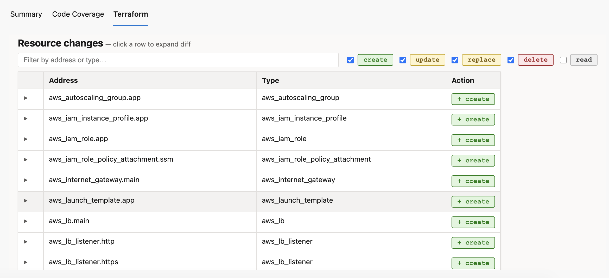
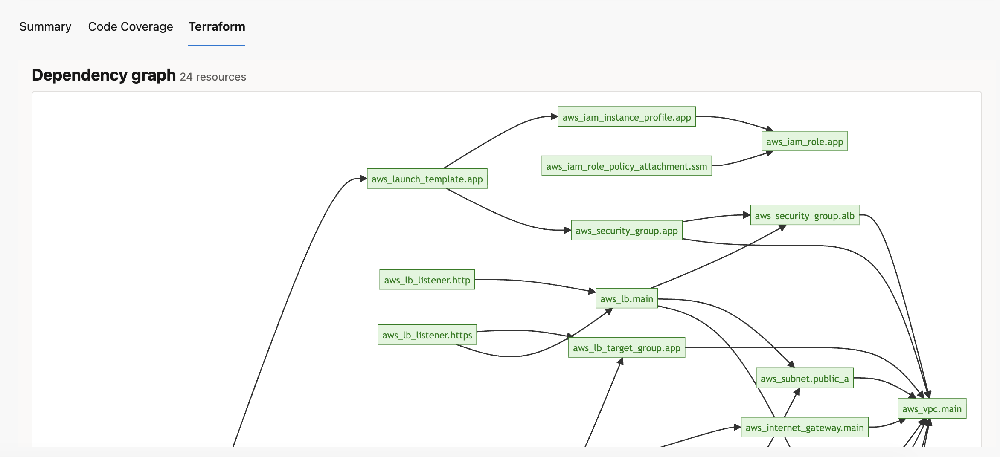

# Plan Visualization

The **Terraform** tab appears on every build that ran a plan step with `publishPlanArtifact: true`.

## Resource list and summary bar

The first thing you see is a one-line blast radius summary followed by the full resource list:


```
+20 add   ~3 change   ±1 replace   −2 destroy
```

## Color-coded change table

Every resource that will change is listed with a color-coded action badge. Click any row to expand a full before/after attribute diff.



| Badge | Meaning |
|---|---|
| 🟢 `+ create` | New resource will be created |
| 🟡 `~ update` | Resource will be updated in-place |
| 🟡 `± replace` | Resource will be destroyed and recreated |
| 🔴 `− delete` | Resource will be destroyed |
| ⚪ `○ read` | Data source read |

Use the **search box** to filter by address or type. Use the **action checkboxes** to show/hide specific change kinds.

### Expandable attribute diff

Click any row to expand a full before/after diff:

- Changed attributes highlighted in yellow
- Before values in red, after values in green
- `(known after apply)` for computed values
- `(sensitive)` for masked values — never exposed

## Dependency graph

The diagram shows real resource relationships parsed from `plan.configuration.root_module.resources[*].expressions` in the plan JSON, where nested `references` arrays identify dependencies. Nodes are color-coded by action kind.



> If the graph has no edges, the `references` data may be absent from `expressions`. This is present in normal `terraform plan` output but may be missing with very old Terraform versions.

## Policy warnings

Built-in security checks run automatically. See [Policy Warnings](Policy-Warnings) for the full list.
